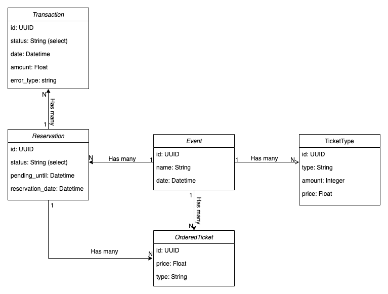

# Ticketonline
A web application enabling tickets purchase.

## Environments and running the app
The application consists of 2 environments - dev environment and production envrionment (set by default).

To change the current environment go to `environments` directory and run `./prodmode` for enabling production environment 
or run `./devmode` for enabling dev environment. Moreover go to `ticketonline/settings/__init__.py` and change the first row
to `from .production import *` for production mode or `from .dev import *` for dev mode.

To launch the app simply run `docker-compose up` in a root directory. The application should run on port 8000.

## Database class diagram
 

There are a few defined models responsible for data storage in the database.

#### Event
Model stores data related to single event. It contains the name of the event and exact date and time when the event will happen.

#### TicketType
Model stores data related to type of the ticket defined by event host. 
Each event can have multiple types of tickets and categorize them freely.
Model also defines the amount of the tickets of certain type which are released to be sold.
Every ticket type has its own price. 
A particular ticket type can be related to only one event.

#### OrderedTicket
Model stores data related to tickets ordered by users.
Each ticket has its own type and price. Ordered tickets are related to Event model and Reservation model.

#### Reservation
Model stores data related to reservation for particular event.
There are 3 defined reservation statuses:
 - CANCELLED (reservation expired and payment was not received)
 - PENDING (default, reservation was made and it is counting 15 minutes from now on to receive a payment)
 - COMPLETED (payment was received and tickets are confirmed to be bought by user)

Every reservation has a particular date and time until which it is pending until. 
It is a certain hour until which the system keeps the tickets booked until it will receive payment confirmation.
If the payment will not be handled by then, the system worker will change reservation status to CANCELLED. 

Every reservation has a reservation date which stands for a date and time when exactly the reservation has been made.

#### Transaction
Transaction model stores data related to payment for particular reservation.
Every transaction has its own status: 
 - COMPLETED (payment successfull)
 - PENDING (waiting for gateway response)
 - ERROR (payment unsuccessfull)

Every payment has its own date and time. Moreover it stores the amount of money transferred.
If any error occurs while payment process it is being stored in the database as a error_type.

## Endpoints
URL | METHOD | PAYLOAD | RETURN VALUE | DESCRIPTION |
----|--------|---------|--------------|-------------|
/events/event/ | GET | `current_page`:number, `page_size`: number | `events`: list, `last_page`: number | Endpoint returns a paginated list of all upcoming events available in the database.
/events/event/ | POST | `event_id`: string | `event`: dict, `ticket_types`: list | Endpoint returns detailed info about particular event based on given event id.  
/events/reservation/ | GET | `reservation_id`: string | `reservation`: dict, `tickets`: list, `event`: dict | Endpoint returns detailed info about the reservation. 
/events/reservation/ | POST | `event_id`: string, `tickets`: list | `reservation_id`: string, `ok/error`: string | Endpoint handles creating a reservation of N tickets for particular event. Application assumes maximum 5 tickets of each type. Example payload {'event_id': 'some_event_id123', 'tickets': [{"type":"VIP", "amount": 3}, {"type":"Silver", "amount": 3}]}
/events/reservation/ | PUT | `reservation_id`: string | `reservation_id`: string, `ok/error`: string | Endpoint handles payment simulation for given reservation.
/events/reservation/ | DELETE | None | `ok/error`: string | Endpoint enables cancelling the reservation initiated by user. Endpoint verifies if user can cancel this reservation by checking the `reservation_id` session variable kept for 15 minutes since reservation starts.
/events/stats/ | GET | `event_id`: string | `event`: dict, `ticket_counters`: dict |  Endpoint returns statistics for given event. It counts all the tickets sold for particular event and returns dictionary with ticket type as a key and amount of sold tickets as a value.

## General application functionality

## Further notes
